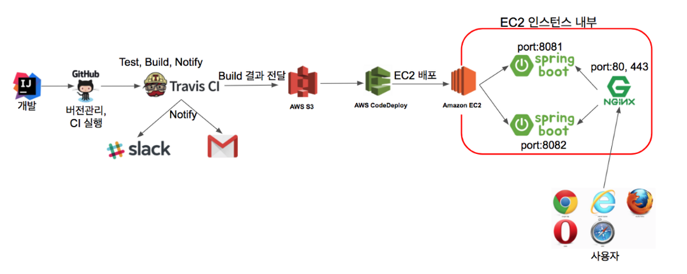

# springboot2-webservice
:pencil: SpringBoot와 AWS를 이용한 웹서비스 구축 :pencil:

### 기술 스택

Framework: springboot 2.1.7

Build tool: gradle 4
 
Java version: jdk 1.8

Unit Test: JUnit 4

Deploy: AWS EC2, AWS RDS(MariaDB), AWS S3, AWS CodeDeploy, Travis CI, Nginx(proxy)

### 시스템 구조

